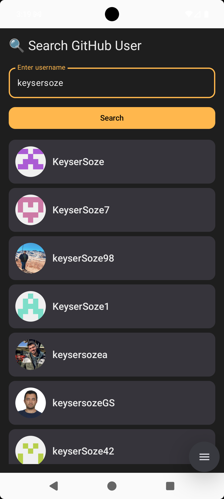
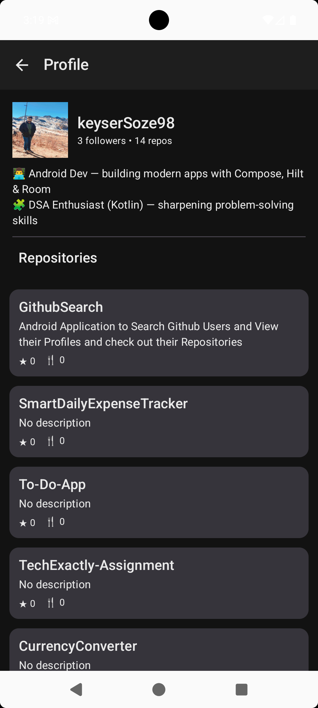

# 📱 GitHub User Explorer

A simple Android app built with **Jetpack Compose**, **MVVM Architecture**, **Hilt DI**, and **Paging 3** to search GitHub users and explore their profiles & repositories.

---

## ✨ Features

- 🔍 **Search GitHub Users** by username
- 👤 **Profile Screen** with avatar, bio, followers, repo count
- 📂 **Repositories List** with stars & forks
- 🔄 **Pull-to-Refresh** for user details and repos
- 🌙 **Dark / Light Mode** support with custom theming
- ⚡ Built with **modern Android best practices**

---

## 🛠 Tech Stack

- **UI:** [Jetpack Compose](https://developer.android.com/jetpack/compose)  
- **Architecture:** MVVM Architecture  
- **DI:** [Hilt](https://developer.android.com/training/dependency-injection/hilt-android)  
- **Networking:** [Retrofit](https://square.github.io/retrofit/) + [OkHttp Logging Interceptor](https://square.github.io/okhttp/)  
- **Async:** [Kotlin Coroutines](https://kotlinlang.org/docs/coroutines-overview.html)  
- **Image Loading:** [Coil](https://coil-kt.github.io/coil/compose/)  
- **Pagination:** [Paging 3](https://developer.android.com/topic/libraries/architecture/paging/v3-overview)  
- **Pull-to-Refresh:** [Accompanist SwipeRefresh](https://google.github.io/accompanist/swiperefresh/)  

---

## 📸 Screenshots

| Search Screen | Profile Screen |
|---------------|----------------|
|  |  |

---

## 📦 APK Download

👉 [Download latest APK](docs/apk/GithubSearch_V1.0)

*(APK is provided via GitHub Releases as email attachments are not supported)*

---

## 🚀 Getting Started

### Prerequisites
- Android Studio **Ladybug** or newer  
- JDK 11+  
- Gradle 8+  

### Steps
1. Clone the repository
   ```bash
   git clone https://github.com/keyserSoze98/GithubSearch
